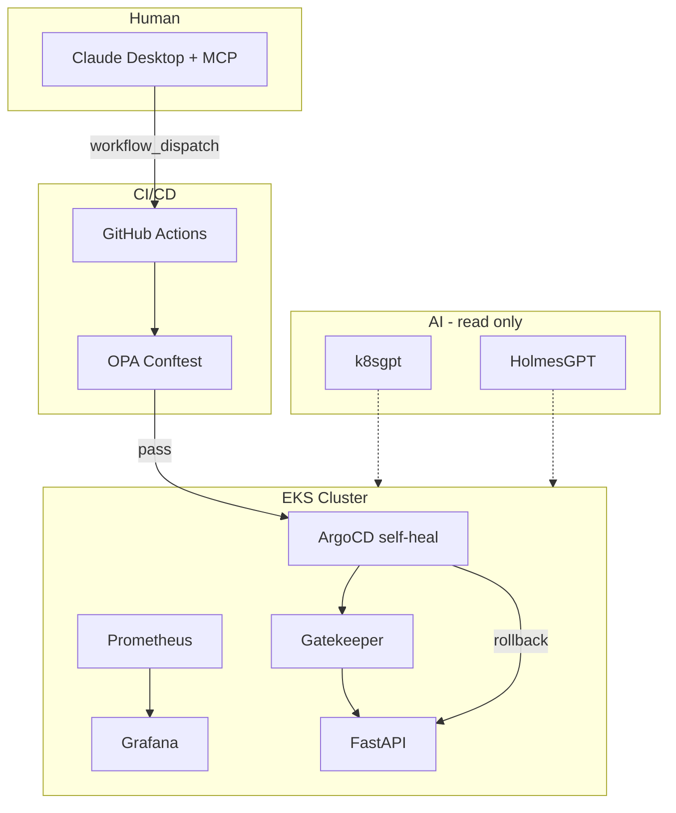

# Architecture

## Component locations

| Component | Path |
|-----------|------|
| EKS Terraform | `foundation/terraform/eks/` |
| OPA Rego | `foundation/policies/opa/` |
| Gatekeeper | `foundation/policies/gatekeeper/` |
| ArgoCD apps | `gitops/argocd/` |
| FastAPI app | `workload/fastapi/` |
| Demo 2 | `demos/demo2-chat-to-deploy/` |
| GitHub Actions | `.github/workflows/` |
